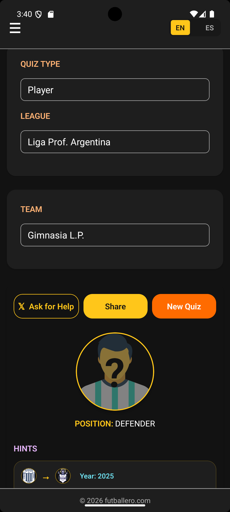

# Test-Driven Code Generation (TDCG)

## A method for writing software with AI without losing control

**Version:** 0.1, April 2026

---

## The problem

AI tools are fast. Very fast. But fast in the wrong direction is worse than slow.

Without a method, AI-generated code piles up: untested, inconsistent, and hard to review. You end up with a lot of code and not much confidence.

TDCG keeps the human in charge of what matters: the specification, the tests, and the review. The AI handles the first draft.

---

## The idea

In classical TDD, the human writes both the test and the implementation.

In TDCG, **the AI generates both**. The human specifies the behavior, reviews the tests before any implementation starts, then reviews the implementation. Nothing moves forward without human approval at each step.

> The AI generates. The human decides what's right.

---

## The loop

```
1. SPECIFY  — say what you want to build, in plain language
2. RED      — AI generates failing tests; human reviews and approves them
3. PROMPT   — give the AI the approved tests, the context, and a pattern to follow
4. GREEN    — AI generates the implementation; tests pass
5. REVIEW   — human checks the output for quality, consistency, dead code
6. COMMIT   — one small, focused, tested commit
```

One behavior. One cycle. Repeat.

---

## Step by step

### 1. Specify

Before touching any code, write one or two sentences describing the behavior.

> _The GuessTheTeam screen needs a share button. When pressed, it captures the quiz as a PNG and opens the native share sheet. The existing buttons stay unchanged._

That's it. If you can't say it in two sentences, the cycle is too big. Split it.

---

### 2. Red

The AI generates failing tests. One test per observable behavior. The human reads them, agrees they capture the right behavior, and only then moves forward.

```ts
it("renders share button", () => {
  renderComponent();
  expect(screen.getByTestId("share-button")).toBeTruthy();
});

it("calls RNShare.open when share button is pressed", async () => {
  mockCapture.mockResolvedValueOnce("file:///tmp/quiz.png");
  fireEvent.press(screen.getByTestId("share-button"));
  await waitFor(() => {
    expect(RNShare.open).toHaveBeenCalledWith({
      url: "file:///tmp/quiz.png",
      type: "image/png",
      failOnCancel: false,
    });
  });
});
```

Run them. They fail. That is the correct state.

---

### 3. Prompt

Give the AI three things: the spec, the failing tests, and an existing file to follow as a pattern.

```
Spec: add a share button to GuessTheTeam that captures a PNG and opens RNShare.
Pattern: follow GuessThePlayer.tsx exactly — same state, same handler, same hidden ViewShot.
Tests: [paste the failing tests]
Task: generate the minimal changes to make these tests pass.
```

The pattern is critical. Without it, the AI invents its own approach and drifts from your codebase.

---

### 4. Green

The AI generates the implementation. Run the tests. They must pass.

If something fails, refine the prompt or the spec. Never weaken the test to force green.

---

### 5. Review

Read the output. The AI doesn't know your architecture. You do.

- Does it do one thing?
- Are names clear?
- Any copy-paste instead of reuse?
- Any imports or state that aren't used?

Refactor what needs it. Tests stay green.

**Result from the Matchinsights demo:**



Three buttons, one row, correct visual hierarchy. Generated, tested, and reviewed in a single cycle.

---

### 6. Commit

One commit per cycle. Only after tests pass.

```
[GuessTheTeam] add native share button

Why: replace Twitter-only sharing with native PNG share sheet.
```

---

## Why it works

**The test is the contract.** Writing it forces you to think about the interface before the implementation. Same discipline as TDD, now applied to AI generation.

**Short cycles prevent drift.** The longer the prompt, the more the AI improvises. One behavior per cycle keeps the output small enough to actually review.

**The review is the gate.** AI output that violates your architecture doesn't get committed. The method makes that check explicit, not optional.

---

## When it works best

- Adding behavior to a component when a similar one already exists
- Implementing something new that follows a clear established pattern
- Any work where the "what" is clear but writing it from scratch would take time

## When to be careful

- Greenfield design with no pattern to follow (your spec needs to be much more precise)
- Performance-critical code (AI favors readability over throughput)

---

## Using this with Claude Code

If you use [Claude Code](https://claude.ai/code), you can make it follow the TDCG loop automatically.

Drop a `CLAUDE.md` file at the root of your project. Claude reads it at the start of every session and follows the rules without you having to explain them again.

A ready-to-use example is in [CLAUDE.md](CLAUDE.md). Replace the project section with your own repos and you're set.

---

## Case study

This method was developed and validated while building the [Matchinsights](https://futballero.com) football platform.

The features used as examples throughout this document come from [MOBILE_SHARING_PLAN.md](MOBILE_SHARING_PLAN.md).

---
